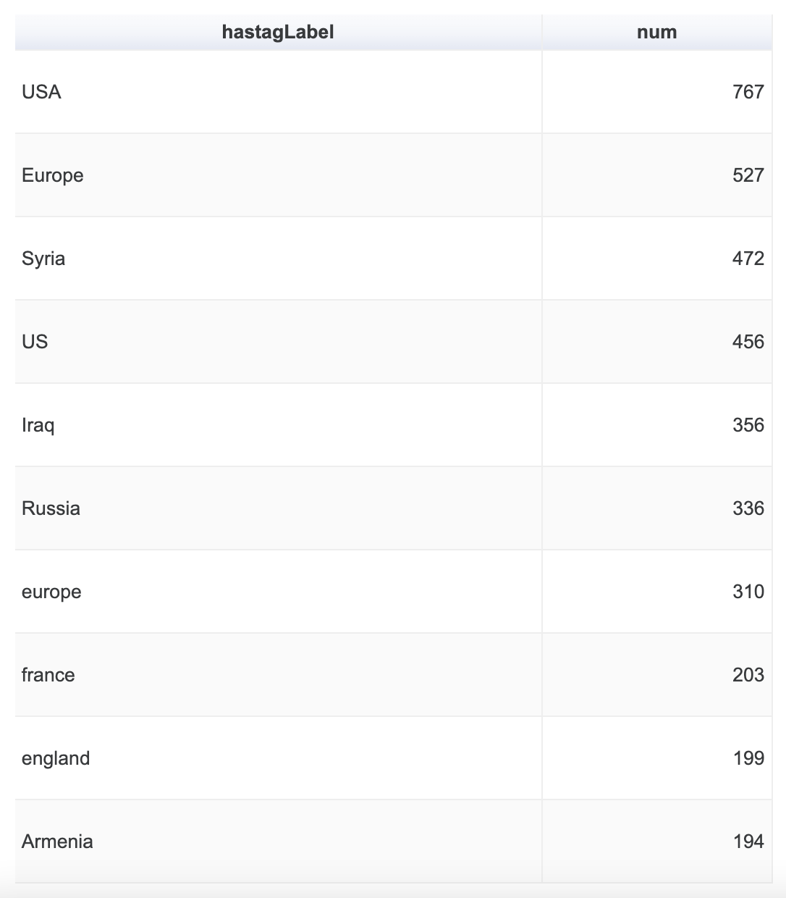

# MigrationsKB 


## 1. Introduction 

**MigrationsKB(MGKB)** is a public Knowledge Base of anonymized **Migration** related **annotated** tweets.
The MGKB currently contains over **200 thousand** tweets, spanning over 9 years (January 2013 to July 2021),
filtered with 11 European countries of *the United Kingdom, Germany, Spain, Poland, France, Sweden, Austria, Hungary, Switzerland, Netherlands and Italy*.
**Metadata** information about the tweets, such as Geo information (**place name**, **coordinates**, **country code**).
**MGKB** contains **entities**, **sentiments**, **hate speeches**, **topics**, **hashtags**, _encrypted user mentions_ in RDF format.
The schema of **MGKB** is an extension of TweetsKB for migrations related information.
Moreover, to associate and represent the potential economic and social factors driving the migration flows such as [**eurostat**](https://ec.europa.eu/eurostat/web/main/home), 
[**statista**](https://www.statista.com/), etc. FIBO ontology was used. The extracted **economic indicators**,
such as GDP Growth Rate, are connected with each Tweet in RDF using geographical and temporal dimensions.
The user IDs and the tweet texts are encrypted for privacy purposes, while the tweet IDs are preserved.


##  2. [RDF/S Model](#rdfs_model)
### Overall Schema 


### Schema for Economic Indicators and Provenance Information


<details>
<summary> <b style="background-color: lightgrey"> Financial Industry Business Ontology (FIBO) representing Economic Indicators of EU</b></summary>
<ul>
<li>The class <tt>fibo-ind-ei-ei:GrossDomesticProduct</tt> represents the GDPR of the country of the tweet in a certain year, 
which are specified by the properties <tt>schema:addressCountry</tt> 
and  <tt>dc:date</tt>from DCMI, and the value of this indicator is represented by
<tt>fibo-ind-ei-ei:hasIndicatorValue</tt> </li>

<li>
The class <tt>fibo-ind-ei-ei:UnemploymentRate</tt> represents the unemployment rate in the country of
the tweet in a certain year, represented with the help of the same properties, 
i.e.,  <tt>schema:addressCountry</tt>, <tt>dc:date</tt>, and <tt>fibo-ind-ei-ei:hasIndicatorValue</tt>.</li>

<li>The class <tt>fibo-ind-ei-ei:UnemployedPopulation</tt> is used to specify the population of the unemployment rate. </li>
<li>The class <tt>fibo-fnd-dt-fd:ExplicitDate</tt> represents the date when the statistics are last updated as a literal with the help of the property <tt>fibo-fnd-dt-fd:hasDateValue</tt>.</li>
<li>The property <tt>fibo-fnd-rel-rel:isCharacterizedBy</tt>  is used to associate a tweet with the economic indicators.</li>
</ul>
</details>

<details>
<summary>
<b style="background-color: lightgrey">PROV-O representing Provenance Information</b>
</summary>
<p>To represent the provenance information about the economic indicators, i.e., Eurostat, Statista, UK parliament, and Office of National Statistics, PROV-O is used. The class <tt>prov:Activity</tt> defines an activity that occurs over a period of time and acts upon entities, which are defined by the class <tt>prov:Entity</tt>. The class <tt>fibo-fnd-arr-asmt:AssessmentActivity</tt> represents an assessment activity involving the evaluation and estimation of the economic indicators, which is a subclass of the class <tt>prov:Activity</tt>.
The class  <tt>prov:Organization</tt> represents a governmental organization or a company that is associated with the assessment activity, which is a subclass of the class <tt>prov:Agent</tt>. </p>

</details>

<details>
<summary><b style="background-color: lightgrey">Further extensions</b></summary>
<ul>
<li><tt>dc:subject</tt> represents a topic of a tweet resulting from topic modeling.</li>
<li> <tt>wna:neutral-emotion</tt>  represents the neutral sentiment of the tweet by applying sentiment analysis.</li>
<li> <tt> wna:hate</tt>, <tt>mgkb:offensive</tt> and <tt> mgkb:normal</tt> represent the hate speeches, offensive speeches and normal speeches from hate speech detection of the tweets.</li>
<li> <tt>schema:ReplyAction</tt> represents the action of reply regarding a tweet.</li>
<li> <tt>mgkb:EconomicIndicators</tt> represents the economic indicators, which has the subclasses <tt>fibo-ind-ei-ei:GrossDomesticProduct</tt> and <tt>fibo-ind-ei-ei:UnemploymentRate</tt>.</li>
<li><tt>t mgkb:YouthUnemploymentRate</tt> and <tt>mgkb:TotalUnemploymentRate</tt> represent the unemployment rates with respect to the population, i.e., the youth unemployment population and the total unemployed population.</li>
</ul>
</details>


:clipboard: [Documentation of RDF Model](migrationsKB/documentation.html)

:pencil: [Codes](https://github.com/migrationsKB/MGKB) 

:open_file_folder: [Data](https://zenodo.org/record/5206820#.YRqF1nUza0o)

:question: [SPARQL endpoint](https://mgkb.fiz-karlsruhe.de/sparql/)

:page_with_curl: [Technical Report (arXiv)](https://arxiv.org/pdf/2108.07593.pdf) 

## 3. Overall Framework


## 3. Purpose
* Provide query-able resource about public attitudes on social media towards migration
* Provide an insight into which factors in terms of economic indicators are the driving factors of that attitude.

## 4. Geo Map of The Tweets
<iframe width="100%" height="520" frameborder="0" src="https://migrationskb.carto.com/builder/55b7655b-30de-41c9-9e09-2ab30284c225/embed" allowfullscreen webkitallowfullscreen mozallowfullscreen oallowfullscreen msallowfullscreen></iframe>
[Download `MapOfTweets`](data/MapOfTweets.carto)


## 5. MGKB at a glance
**Classes**: <a href="https://migrationskb.github.io/MGKB/#EconomicIndicators">EconomicIndicators </a>|
<a href="https://migrationskb.github.io/MGKB/#UnemploymentRate">UnemploymentRate </a>|
<a href="https://migrationskb.github.io/MGKB/#LongTermUnemploymentRate">LongTermUnemploymentRate </a>|
<a href="https://migrationskb.github.io/MGKB/#TotalUnemploymentRate">TotalUnemploymentRate </a>|
<a href="https://migrationskb.github.io/MGKB/#YouthUnemploymentRate">YouthUnemploymentRate </a>|
<a href="https://migrationskb.github.io/MGKB/#Income">Income </a>|
<a href="https://migrationskb.github.io/MGKB/#DisposableIncome">DisposableIncome </a>|

**Individuals**: <a href="https://migrationskb.github.io/MGKB/#offensive">offensive </a>|
<a href="https://migrationskb.github.io/MGKB/#normal">normal </a>


### 5.1 MGKB Classes and Properties 

<a id="EconomicIndicators" style="color:black;font-weight:bold;font-size:20px">Class: mgkb:EconomicIndicators </a>

* Description: EconomicIndicators- Represent the economic indicators such as unemployment rate, gross domestic product growth rate,
and income.
* Sub-classes: <a href="https://spec.edmcouncil.org/fibo/ontology/IND/EconomicIndicators/EconomicIndicators/UnemploymentRate">fibo-ind-ei-ei:UnemploymentRate</a>,
<a href="https://spec.edmcouncil.org/fibo/ontology/IND/EconomicIndicators/EconomicIndicators/GrossDomesticProduct">fibo-ind-ei-ei:GrossDomesticProduct</a>, 
<a href="https://migrationskb.github.io/MGKB/#Income">mgkb:Income</a>
* In domain of:
<a href="http://www.w3.org/ns/prov#wasGeneratedBy">prov1:wasGeneratedBy</a>,
<a href="http://www.w3.org/1999/02/22-rdf-syntax-ns#type">rdf:type</a>

<hr>
<a id="UnemploymentRate" style="color:black;font-weight:bold; font-size:20px">Class: mgkb:UnemploymentRate</a>

* Description: an economic indicator representing the ratio of the unemployed population with respect to the civilian labor force of a given economy for some specified period.
* Super-classes: <a href="https://migrationsKB.github.io/MGKB#EconomicIndicators">mgkb:EconomicIndicators</a>
* Sub-classes: <a href="https://migrationsKB.github.io/MGKB#TotalUnemploymentRate">mgkb:TotalUnemploymentRate</a>,
<a href="https://migrationsKB.github.io/MGKB#LongTermUneploymentRate">mgkb:LongTermUneploymentRate</a>,
<a href="https://migrationsKB.github.io/MGKB#YouthUnemploymentRate">mgkb:YouthUnemploymentRate</a>
* In range of: 
<a href="https://spec.edmcouncil.org/fibo/ontology/FND/Relations/Relations/isCharacterizedBy">fibo-fnd-rel-rel:isCharacterizedBy</a>


<hr>

<a id="LongTermUnemploymentRate" style="color:black;font-weight:bold; font-size:20px">Class: mgkb:LongTermUnemploymentRate</a>
* Description: Total long term (12 months or more) unemployment rate, All ISCED 2011 levels (Education all levels)
* Super-classes: <a href="https://spec.edmcouncil.org/fibo/ontology/IND/EconomicIndicators/EconomicIndicators/UnemploymentRate">fibo-ind-ei-ei:UnemploymentRate</a>
* In domain of: <a href="https://spec.edmcouncil.org/fibo/ontology/IND/EconomicIndicators/EconomicIndicators/hasDurationOfUnemployment">fibo-ind-ei-ei:hasDurationOfUnemployment</a>,
<a href="https://spec.edmcouncil.org/fibo/ontology/FND/Utilities/Analytics/hasArgument">fibo-fnd-utl-alx:hasArgument</a>

<hr>

<a id="TotalUnemploymentRate" style="color:black;font-weight:bold;font-size:20px">Class: mgkb:TotalUnemploymentRate</a>
* Description: The unemployment rate which of the active population aged from 15 to 74 years old. PC_ACT: Percentage of population in the active labor force
* Super-classes: <a href="https://spec.edmcouncil.org/fibo/ontology/IND/EconomicIndicators/EconomicIndicators/UnemploymentRate">fibo-ind-ei-ei:UnemploymentRate</a>
* In domain of: <a href="https://spec.edmcouncil.org/fibo/ontology/FND/Arrangements/Reporting/hasReportDate">fibo-fnd-arr-rep:hasReportDate</a>,
<a href="http://schema.org/addressCountry">schema:addressCountry</a>,
<a href="http://purl.org/dc/elements/1.1/date">dc:date</a>,
<a href="https://spec.edmcouncil.org/fibo/ontology/IND/EconomicIndicators/EconomicIndicators/hasIndicatorValue">fibo-ind-ei-ei:hasIndicatorValue</a>,
<a href="https://spec.edmcouncil.org/fibo/ontology/FND/Utilities/Analytics/hasArgument">fibo-fnd-utl-alx:hasArgument</a>


<hr>

<a id="YouthUnemploymentRate" style="color:black;font-weight:bold;font-size:20px">Class: mgkb:YouthUnemploymentRate</a>

* Description: The unemployment rate which of the active population aged from 15 to 24 years old.
* Super-classes: <a href="https://spec.edmcouncil.org/fibo/ontology/IND/EconomicIndicators/EconomicIndicators/UnemploymentRate">fibo-ind-ei-ei:UnemploymentRate</a>
* In domain of:
<a href="https://spec.edmcouncil.org/fibo/ontology/FND/Arrangements/Reporting/hasReportDate">fibo-fnd-arr-rep:hasReportDate</a>,
<a href="http://schema.org/addressCountry">schema:addressCountry</a>,
<a href="https://spec.edmcouncil.org/fibo/ontology/FND/Utilities/Analytics/hasArgument">fibo-fnd-utl-alx:hasArgument</a>,
<a href="https://spec.edmcouncil.org/fibo/ontology/IND/EconomicIndicators/EconomicIndicators/hasIndicatorValue">fibo-ind-ei-ei:hasIndicatorValue</a>,
<a href="http://purl.org/dc/elements/1.1/date">dc:date</a>


<hr>

<a id="Income" style="color:black;font-weight:bold;font-size:20px">Class: mgkb:Income</a>

* Description: Income of households.
* Super-classes: <a href="https://migrationsKB.github.io/MGKB#EconomicIndicators">mgkb:EconomicIndicators</a>
* Sub-classes: <a href="https://migrationsKB.github.io/MGKB#DisposableIncome">mgkb:DisposableIncome</a>
* In range of: <a href="https://spec.edmcouncil.org/fibo/ontology/FND/Relations/Relations/isCharacterizedBy">fibo-fnd-rel-rel:isCharacterizedBy</a>


<hr>
<a id="DisposableIncome" style="color:black;font-weight:bold;font-size:20px">Class: mgkb:DisposableIncome</a>

* Description: Disposable income, net Euro per habitant, Balance.
* Super-classes: <a href="https://migrationsKB.github.io/MGKB#Income">mgkb:Income</a>
* In domain of: <a href="https://spec.edmcouncil.org/fibo/ontology/FND/Arrangements/Reporting/hasReportDate">fibo-fnd-arr-rep:hasReportDate</a>,
<a href="http://schema.org/addressCountry">schema:addressCountry</a>,
<a href="http://purl.org/dc/elements/1.1/date">dc:date</a>,
<a href="https://spec.edmcouncil.org/fibo/ontology/FND/Accounting/CurrencyAmount/hasMonetaryAmount">fibo-fnd-acc-cat:hasMonetaryAmount</a>


<hr>
<a id="offensive" style="color:black;font-weight:bold;font-size:20px">mgkb:offensive</a>
* Description: Named individual, represents offensive speeches resulted from hate speech detection.
* Classes: <a href="http://www.gsi.dit.upm.es/ontologies/onyx/ns#EmotionCategory">onyx:EmotionCategory</a>

<hr>
<a id="normal" style="color:black;font-weight:bold;font-size:20px">mgkb:normal</a>
* Description: Named individual, represents normal speeches resulted from hate speech detection.
* Classes: <a href="http://www.gsi.dit.upm.es/ontologies/onyx/ns#EmotionCategory">onyx:EmotionCategory</a>


<a id="stats_plots" style="color:black;font-weight:bold;font-size:20px">
6. Statistics and Plots
</a>


### 6.1. Statistics of the EU countries with the most first time asylum applicants
[source](https://ec.europa.eu/eurostat/databrowser/view/tps00191/default/table?lang=en) 

<details>
<summary><b style="background-color:lightgrey">  Table  </b></summary>

<table>
<thead>
<tr>
<th>Country</th>
<th>2013</th>
<th>2014</th>
<th>2015</th>
<th>2016</th>
<th>2017</th>
<th>2018</th>
<th>2019</th>
<th>2020</th>
<th>SUM</th>
</tr>
</thead>
<tbody>
<tr>
<td>Germany</td>
<td>126705</td>
<td>202645</td>
<td>476510</td>
<td>745160</td>
<td>222565</td>
<td>184180</td>
<td>165615</td>
<td>121955</td>
<td>2245335</td>
</tr>
<tr>
<td>Spain</td>
<td>4485</td>
<td>5615</td>
<td>14780</td>
<td>15755</td>
<td>36610</td>
<td>54050</td>
<td>117800</td>
<td>88530</td>
<td>337625</td>
</tr>
<tr>
<td>Poland</td>
<td>15240</td>
<td>8020</td>
<td>12190</td>
<td>12305</td>
<td>5045</td>
<td>4110</td>
<td>4070</td>
<td>2785</td>
<td>63765</td>
</tr>
<tr>
<td>France</td>
<td>66265</td>
<td>64310</td>
<td>76165</td>
<td>84270</td>
<td>99330</td>
<td>137665</td>
<td>151070</td>
<td>93470</td>
<td>772545</td>
</tr>
<tr>
<td>Sweden</td>
<td>54270</td>
<td>81185</td>
<td>162450</td>
<td>28795</td>
<td>26330</td>
<td>21560</td>
<td>26255</td>
<td>16225</td>
<td>417070</td>
</tr>
<tr>
<td>United Kingdom</td>
<td>30585</td>
<td>32785</td>
<td>40160</td>
<td>39735</td>
<td>34780</td>
<td>38840</td>
<td>46055</td>
<td>36041</td>
<td>298981</td>
</tr>
<tr>
<td>Austria</td>
<td>17500</td>
<td>28035</td>
<td>88160</td>
<td>42255</td>
<td>24715</td>
<td>13710</td>
<td>12860</td>
<td>14180</td>
<td>241415</td>
</tr>
<tr>
<td>Hungary</td>
<td>18895</td>
<td>42775</td>
<td>177135</td>
<td>29430</td>
<td>3390</td>
<td>670</td>
<td>500</td>
<td>115</td>
<td>272910</td>
</tr>
<tr>
<td>Switzerland</td>
<td>21305</td>
<td>23560</td>
<td>39445</td>
<td>27140</td>
<td>18015</td>
<td>15160</td>
<td>14195</td>
<td>10990</td>
<td>169810</td>
</tr>
<tr>
<td>Netherlands</td>
<td>13065</td>
<td>24495</td>
<td>44970</td>
<td>20945</td>
<td>18210</td>
<td>24025</td>
<td>25200</td>
<td>15255</td>
<td>186165</td>
</tr>
<tr>
<td>Italy</td>
<td>26620</td>
<td>64625</td>
<td>83540</td>
<td>122960</td>
<td>128850</td>
<td>59950</td>
<td>43770</td>
<td>26535</td>
<td>556850</td>
</tr>
</tbody>
</table>


</details>

### 6.2. Statistics of Tweets before and after ETM

#### Selecting Migration-related Tweets

[//]: # (<details>)

[//]: # (<summary><b style="background-color:lightgrey">Detail</b></summary>)

[//]: # (<p>)

[//]: # (Green referes to migration-related topics, and orange refers to other topics. )

[//]: # (MGPS refers to the maximal migration-related topic probaiblity score.)

[//]: # ()
[//]: # (<a href="images/tm_filter/tweet_filtering.png">)

[//]: # ()

[//]: # (</a>)

[//]: # ()
[//]: # (The tweets are then refined based on topic embeddings.)

[//]: # (For each topic, the  <a href="https://bit.ly/2SZgpKb">top 20 words</a> &#40;ranked by their probability&#41; are )

[//]: # (selected as representatives of the topic. )

[//]: # (These words are then manually verified based on their relevance to the topic )

[//]: # (of migration, accordingly, <a href="https://bit.ly/30z25wp">the migration-related topics</a> are )

[//]: # (chosen. )

[//]: # (The migration-related tweets are chosen with the help of the probabilities )

[//]: # (associated to all the topics. Regarding the chosen topics, )

[//]: # (the maximal probability score for each tweet is extracted. )

[//]: # ()
[//]: # (For this tweet, it has the <b>maximal migration-related topic probability score &#40;MGPS&#41;</b> 0.8.)

[//]: # ()
[//]: # (By manual evaluation, the threshold for reserving the tweets by the maximal probability score is set to 0.45. Hence, )

[//]: # (the tweet showed in the Figure is reserved for further analysis.)

[//]: # (</p>)

[//]: # (</details>)


<details>
<summary><b style="background-color:lightgrey">The distribution of maximal probability scores of tweets regarding migration-related topics before filtering</b></summary>
<a href="images/tm_filter/dist_topic_max_scores_50.png">

</a>
</details>

<details>
<summary><b style="background-color:lightgrey">The distribution of maximal probability scores of tweets regarding migration-related topics after filtering</b></summary>
<a href="images/tm_filter/dist_topic_max_scores_50_t4.5.png">

</a>
</details>


<a id="topics_etm" style="color:black;font-weight:bold;font-size:18px">
6.3. Topics from ETM
</a>


<table border="1"><tr><th>0</th><td>immigrant, war, free, amazing, etc, far, cross, iameuropean, boat, play, maybe, book, wrong, fuck, like, daily, hate, greece, islam, escape</td></tr><tr><th>1</th><td>refugee, iraq, humanrights, stand, important, poor, citizen, economic, flee, iran, join, instagram, parliament, donate, try, al, worry, end, fake, dover</td></tr><tr><th>2</th><td>immigrant, muslim, save, god, offer, govt, racism, abuse, value, india, bill, dead, interview, eat, china, landscape, obama, eastern, complain, dear</td></tr><tr><th>3</th><td>asylum, aid, spend, union, aliens, heart, shame, block, refugeeweek, zone, rid, entry, search, field, worldrefugeeday, tune, produce, ha, eg, wednesday</td></tr><tr><th>4</th><td>europe, budapest, hungary, eurotrip, miss, small, enjoy, outside, rain, throwback, tbt, song, inside, europetour, coffee, individual, canada, petition, look, driver</td></tr><tr><th>5</th><td>eu, migrant, send, pm, ukip, plan, crime, criminal, increase, simply, contribute, rights, charity, milano, ship, special, date, responsible, settle, joke</td></tr><tr><th>6</th><td>man, law, come, see, job, debate, public, listen, gay, eye, create, result, status, voter, east, yeah, warsaw, opinion, include, catch</td></tr><tr><th>7</th><td>year, love, uk, people, ago, police, month, black, set, hand, festival, message, bridge, imagine, mr, second, colleague, fit, stage, arkham</td></tr><tr><th>8</th><td>refugee, seeker, kill, alien, video, enter, experience, deport, check, list, regime, pretty, genuine, picture, artist, currently, fly, chance, later, activist</td></tr><tr><th>9</th><td>europe, head, nation, sunset, strong, close, promise, ok, sit, fun, euro, garden, steal, cathedral, defend, baby, minute, let, europetravel, wine</td></tr><tr><th>10</th><td>migrant, week, open, film, lie, peace, africa, late, join, israel, rescue, land, term, climate, tourism, final, court, couple, streetphotography, flag</td></tr><tr><th>11</th><td>italy, germany, european, place, travel, night, venice, street, instagood, march, sad, class, tour, wonderful, fire, picoftheday, photographer, frankfurt, powerful, center</td></tr><tr><th>12</th><td>work, refugee, covid, border, woman, long, uk, young, hard, poland, power, photooftheday, politic, foreign, deny, traveler, session, ppl, pride, test</td></tr><tr><th>13</th><td>day, support, refugee, exile, yes, mass, action, door, kind, spring, brilliant, continue, birthday, meeting, receive, decide, fantastic, monday, reach, pressure</td></tr><tr><th>14</th><td>new, give, architecture, group, united, come, challenge, yourewelcome, matter, break, centre, welcomehome, fashion, difference, church, include, risk, blue, visa, record</td></tr><tr><th>15</th><td>home, come, immigration, bad, french, food, fact, business, sure, russia, sun, humanitarian, refuge, trade, security, consider, religion, dinner, hundred, surely</td></tr><tr><th>16</th><td>live, brexit, rome, immigration, run, migration, million, happen, number, probably, green, hell, treat, past, lake, fund, foreigner, today, look, finish</td></tr><tr><th>17</th><td>family, friend, labour, allow, st, channel, international, drink, remember, actually, guy, beer, cut, campaign, tower, sorry, mp, patel, sell, bloody</td></tr><tr><th>18</th><td>immigration, people, policy, community, proud, thousand, buy, glasgow, game, impact, common, brother, tomorrow, available, officer, affect, nd, vulnerable, ignore, queue</td></tr><tr><th>19</th><td>camp, vienna, racist, tory, fight, share, case, member, hear, lead, office, forget, tweet, council, solidarity, celebrate, resident, rest, approach, one</td></tr><tr><th>20</th><td>happy, care, make, view, walk, low, vacation, social, article, clear, dog, staff, wage, main, australia, rt, boy, greek, round, go</td></tr><tr><th>21</th><td>syria, europe, trip, sky, isis, die, pro, threat, choose, assad, unitedkingdom, passport, destroy, travel, river, torture, youth, skilled, humanrightsviolation, load</td></tr><tr><th>22</th><td>way, uk, thing, get, immigrant, issue, have, wait, mean, deal, arrive, minister, homeless, guess, present, keep, whilst, mile, press, company</td></tr><tr><th>23</th><td>say, think, rule, america, person, travelgram, water, politician, explain, fair, race, act, instatravel, mother, life, completely, referendum, official, generation, way</td></tr><tr><th>24</th><td>help, today, thank, berlin, learn, team, refugees, calais, mountain, spanish, victim, munich, bit, go, region, thought, ukraine, rape, ill, deportation</td></tr><tr><th>25</th><td>country, british, let, nhs, safe, bear, try, show, society, beach, sound, forward, irish, early, christmas, geneva, response, majority, put, think</td></tr><tr><th>26</th><td>spain, life, be, story, money, photo, photography, german, true, pariah, raise, sea, project, castle, ready, moment, refuse, lol, bird, poll</td></tr><tr><th>27</th><td>right, need, government, syrian, follow, idea, hold, culture, freedom, global, rise, wing, huge, wife, arrest, target, fill, supporter, live, shut</td></tr><tr><th>28</th><td>france, london, paris, england, music, light, migraine, winter, yesterday, train, building, begin, snow, weather, launch, manage, targetedindividual, grand, migrants, urban</td></tr><tr><th>29</th><td>refugee, crisis, lose, real, turn, force, europeanelection, kingdom, exile, selfie, student, unhcr, possible, work, role, process, awesome, muslims, idiot, training</td></tr><tr><th>30</th><td>time, world, humanity, beautiful, humanright, evening, sort, conference, journey, mention, flight, worldwide, mate, suspect, cash, tear, good, decade, austerity, zurich</td></tr><tr><th>31</th><td>not, like, know, well, feel, house, change, white, weekend, understand, answer, course, terrorist, life, conservative, leadership, bank, influx, accommodation, collaboration</td></tr><tr><th>32</th><td>immigrant, migrant, art, history, win, service, lot, europeanelections, able, focus, dream, like, military, room, large, mental, cause, mind, style, cameron</td></tr><tr><th>33</th><td>state, read, explore, local, leader, europe, fail, sign, national, lunatic, population, fear, concern, democracy, spot, age, step, space, university, wake</td></tr><tr><th>34</th><td>welcome, refugee, uk, problem, refugeeswelcome, seek, word, hotel, base, tax, cloud, car, life, instead, autumn, la, evidence, partner, promote, integration</td></tr><tr><th>35</th><td>solution, den, jewish, identity, episode, stigmabase, gun, afghan, convention, belief, seekers, manifesto, sight, anger, scary, inclusive, location, seville, soft, quota</td></tr><tr><th>36</th><td>migrant, leave, control, worker, report, ask, use, away, return, political, reason, accept, turkey, president, pass, key, army, prove, require, humantrafficking</td></tr><tr><th>37</th><td>look, go, child, start, benefit, school, roma, end, housing, event, interesting, move, somalia, write, cover, tv, treatment, suggest, abroad, form</td></tr><tr><th>38</th><td>human, news, watch, tonight, attack, morocco, travelphotography, museum, bbc, red, self, provide, line, lgbt, parent, rich, violence, single, smile, season</td></tr><tr><th>39</th><td>good, old, morning, face, nice, english, speak, venezuela, nature, soon, death, language, lovely, ireland, add, poverty, european, cool, laugh, hamburg</td></tr><tr><th>40</th><td>uk, netherlands, point, scotland, barcelona, system, believe, trump, visit, adventure, post, milan, boris, education, tories, italian, firenze, piece, exist, positive</td></tr><tr><th>41</th><td>talk, immigration, bring, tell, stay, build, oh, girl, south, african, florence, wish, respect, colour, economy, need, wonder, comment, nigel, truth</td></tr><tr><th>42</th><td>vote, people, immigration, anti, blame, remain, agree, will, election, protect, little, johnson, medium, grow, middle, plus, market, movement, expect, skill</td></tr><tr><th>43</th><td>stop, find, austria, claim, big, high, future, country, situation, american, level, stockholm, friday, europeanunion, traveleurope, doctor, desperate, ground, current, example</td></tr><tr><th>44</th><td>people, take, uk, health, hope, un, try, shoot, easy, finally, cost, tourist, especially, justice, absolutely, hospital, bbcqt, host, football, drop</td></tr><tr><th>45</th><td>immigration, party, area, en, th, hour, access, wall, link, twitter, lockdown, coronavirus, research, sense, realise, scottish, vs, model, perfect, earth</td></tr><tr><th>46</th><td>europe, city, summer, holiday, holland, usa, espaa, online, fall, road, cold, canal, coast, deutschland, somali, flower, polish, colosseum, palace, celiogermanydesk</td></tr><tr><th>47</th><td>great, call, immigration, question, town, airport, protest, north, discuss, europa, discussion, club, islamic, west, turkish, decision, dutch, throw, half, secretary</td></tr><tr><th>48</th><td>immigrant, illegal, want, britain, pay, legal, shit, work, park, island, station, taxis, manchester, give, blair, waste, recently, relax, danger, brown</td></tr><tr><th>49</th><td>travel, amsterdam, switzerland, sweden, farage, meet, italia, kid, madrid, apply, de, wanderlust, non, alllivesmatter, left, travelblogger, expat, memory, folk, europedebate</td></tr></table>


### 6.4. Correlations of the Negative Public Attitudes and The Economic Indicators
More [plots for each destination country](stats.md)

To learn the potential cause of the negative public attitudes towards migrations, the factors such as unemployment
rate including youth unemployment rate and totla unemployment rate, and gross domestic product growth rate (GDPR) were studied.
This data was collected from [Eurostat](https://ec.europa.eu/eurostat), [Statista](https://www.statista.com/),
[UK Parliament](https://www.parliament.uk/), and [Office for National Statistics](https://www.ons.gov.uk/).

The following figure shows the comparison between the factors (such as youth unemployment rate, total unemployment rate,
and real GDPR) and the negative attitudes (i.e., negative sentiment and hate speech) in all the extracted
tweets. On average in all 11 destination countries, the percentages of hate speech and negative sentiment of the public
towards immigration are negatively correlated with the real GDPR and positively correlated with total/youth
unemployment rate, from 2013 to 2018 and from 2019 to 2020. In 2019, the percentages of hateful tweets and negative tweets
are rapidly increased by about 2% and 1% respectively compared to 2018.

<details>
<summary><b style="background-color:lightgrey">Figure</b> </summary>
<a href="images/stats/percentage_correlations/ALL.png">

</a>
</details>

The following figure shows the pairwise correlation between the economic indicators and the posts with negative sentiments
and offensive/hate speeches.


## 7. Sparql Queries
* **Online SPARQL endpoint Query [example](virtuoso.md)**.

* Locally 
  * Download `nt` file for **MGKB** on [Zenodo](https://zenodo.org/record/5206820#.YRqF1nUza0o). 
  * Download and run [Blazegraph](blazegraph.md) Or [GraphDB](https://www.ontotext.com/products/graphdb/)


* Prefixes:
```sparql
prefix mgkb: <https://migrationsKB.github.io/MGKB#> 
prefix dc: <http://purl.org/dc/elements/1.1/> 
prefix fibo_fnd_arr_asmt: <https://spec.edmcouncil.org/fibo/ontology/FND/Arrangements/Assessments/> 
prefix fibo_fnd_arr_rep: <https://spec.edmcouncil.org/fibo/ontology/FND/Arrangements/Reporting/> 
prefix fibo_fnd_dt_fd: <https://spec.edmcouncil.org/fibo/ontology/FND/DatesAndTimes/FinancialDates/> 
prefix fibo_fnd_rel_rel: <https://spec.edmcouncil.org/fibo/ontology/FND/Relations/Relations/> 
prefix fibo_fnd_utl_alx: <https://spec.edmcouncil.org/fibo/ontology/FND/Utilities/Analytics/> 
prefix fibo_ind_ei_ei: <https://spec.edmcouncil.org/fibo/ontology/IND/EconomicIndicators/EconomicIndicators/> 
prefix fibo_ind_acc_cat: <https://spec.edmcouncil.org/fibo/ontology/FND/Accounting/CurrencyAmount/>
prefix nee: <http://www.ics.forth.gr/isl/oae/core#> 
prefix onyx: <http://www.gsi.dit.upm.es/ontologies/onyx/ns#> 
prefix owl: <http://www.w3.org/2002/07/owl#> 
prefix prov: <https://www.w3.org/TR/prov-o/#> 
prefix rdfs: <http://www.w3.org/2000/01/rdf-schema#> 
prefix rdf: <https://www.w3.org/1999/02/22-rdf-syntax-ns#> 
prefix schema: <http://schema.org/> 
prefix sioc: <http://rdfs.org/sioc/ns#> 
prefix sioc_t: <http://rdfs.org/sioc/types#> 
prefix wna: <http://www.gsi.dit.upm.es/ontologies/wnaffect/ns#> 
prefix xsd: <http://www.w3.org/2001/XMLSchema#>
prefix lcc_lr: <https://spec.edmcouncil.org/fibo/ontology/FND/Accounting/CurrencyAmount/>
prefix cidoc_crm: <https://cidoc-crm.org/html/cidoc_crm_v7.1.1.html#>
prefix dcterms: <http://purl.org/dc/terms/>
```

<a id="query_1" style="color:black;font-weight:bold;font-size:16px">
7.1. The following query retrieve a list of top 20 hashtags which contain "refugee" or "immigrant".</a>


```sparql 
SELECT ?hashtagLabel (count(distinct ?tweet) as ?num) WHERE {
  ?tweet schema:mentions ?hashtag.
  ?hashtag a sioc_t:Tag ; rdfs:label ?hashtagLabel.  FILTER( regex(?hashtagLabel, "refugee", "i") || lcase(str(?hashtagLabel))="refugee" ||  regex(?hashtagLabel, "immigrant", "i") || lcase(str(?hashtagLabel))="immigrant").
} GROUP BY ?hashtagLabel ORDER BY DESC(?num) LIMIT 20
```

[comment]: <> ()

[comment]: <> (![]&#40;images/sparql_query_results/top20_hashtags_refugee_immigrant.png&#41;)

<details>
<summary><b style="background-color:lightgrey">Answer</b> </summary>
<a href="images/sparql_query_results/top20_hashtags_refugee_immigrant.png">

</a>
</details>


<a id="query_2" style="color:black;font-weight:bold;font-size:16px">
7.2. The following query retrieve a list of top 10 the entity labels which contain "refugee" and its frequency of detected entity mentions.
</a>

```sparql
SELECT ?entityLabel (count(?entityLabel) as ?numOfEntityMentions)   where{
	?tweet schema:mentions ?entity.
  	?entity a nee:Entity; nee:hasMatchedURI ?uri. 
	?uri a rdfs:Resource; rdfs:label ?entityLabel. FILTER( regex(?entityLabel, "refugee", "i") || lcase(str(?entityLabel))="refugee").
 }GROUP BY ?entityLabel ORDER BY DESC(?numOfEntityMentions) LIMIT 10
```
<details>
<summary><b style="background-color:lightgrey">Answer</b></summary>
<a href="images/sparql_query_results/entity_mentions_containing_refugee.png">

</a>
</details>

[comment]: <> ()

<a id="query_3" style="color:black;font-weight:bold;font-size:16px">
7.3. The following query retrieves a list of emotion categories (neutral/positive/negative sentiment, and hate speeches/offensive/normal) of tweets where the labels of detected entity mentions containing "refugee camp".
 </a>


```sparql
SELECT ?EmotionCategory (count(?tweet) as ?numOfTweets)   where{
	?tweet schema:mentions ?entity.
  	?entity a nee:Entity; nee:hasMatchedURI ?uri. 
	?uri a rdfs:Resource; rdfs:label ?x.  FILTER( regex(?x, "refugee camp", "i") || lcase(str(?x))="refugee camp").
  	?tweet onyx:hasEmotionSet ?y.
  	?y a onyx:EmotionSet; onyx:hasEmotion ?z.
  	?z a onyx:Emotion; onyx:hasEmotionCategory ?EmotionCategory.
 } GROUP BY ?EmotionCategory
```

<details>
<summary><b style="background-color:lightgrey">Answer</b></summary>
<a href="images/sparql_query_results/emotions_entity_containing_refugee_camp.png">

</a>

</details>

[comment]: <> ()


<a id="query_4" style="color:black;font-weight:bold;font-size:16px">
 7.4. The following query requests the top-10 hashtags co-occurring with the entity label containing "refugee".
</a>

```sparql
SELECT ?hastagLabel (count(distinct ?tweet) as ?num) WHERE {
  ?tweet schema:mentions ?entity .
  ?entity a nee:Entity ; nee:hasMatchedURI ?uri .
  ?uri a rdfs:Resource; rdfs:label ?x.  FILTER( regex(?x, "refugee", "i") || lcase(str(?x))="refugee").

  ?tweet schema:mentions ?hashtag.
  ?hashtag a sioc_t:Tag ; rdfs:label ?hastagLabel 
} GROUP BY ?hastagLabel ORDER BY DESC(?num) LIMIT 10
```

<details>
<summary><b style="background-color:lightgrey">Answer</b></summary>
<a href="images/sparql_query_results/top10_coocur_hashtags_with_entity_refugee.png">

</a>
</details>

[comment]: <> ()

[comment]: <> (![]&#40;images/sparql_query_results/top10_coocur_hashtags_with_entity_refugee.png&#41;)


<a id="query_5" style="color:black;font-weight:bold;font-size:16px">
7.5. The following query retrieves GDPR indicator values and the number of tweet hate speeches in the United Kingdom.
</a>


```sparql
SELECT  ?year ?IndicatorValue (count(?tweet) as ?numOfTweets) where {
  ?tweet fibo_fnd_rel_rel:isCharacterizedBy ?gdpr.
  ?gdpr a fibo_ind_ei_ei:GrossDomesticProduct.
  ?gdpr schema:addressCountry "GB". 
  ?gdpr dc:date ?year.
  ?gdpr fibo_ind_ei_ei:hasIndicatorValue ?IndicatorValue.
  ?tweet onyx:hasEmotionSet ?y.
  ?y a onyx:EmotionSet; onyx:hasEmotion ?z.
  ?z a onyx:Emotion; onyx:hasEmotionCategory wna:hate.
 }GROUP BY ?year ?IndicatorValue ORDER BY DESC(?year)
```

<details>
<summary><b style="background-color:lightgrey">Answer</b></summary>
<a href="images/sparql_query_results/gdpr_hate_speech_GB.png">

</a>
</details>

[comment]: <> ()


<a id="query_6" style="color:black;font-weight:bold;font-size:16px">
7.6. The following query retrieves average GDPR indicator values and the number of tweet hate speeches in 11 destination countries.
</a>

```sparql
SELECT  ?year (AVG(?IndicatorValue) AS ?avgIndicatorValue) (count(?tweet) as ?numOfTweets) where {
  ?tweet fibo_fnd_rel_rel:isCharacterizedBy ?gdpr.
  ?gdpr a fibo_ind_ei_ei:GrossDomesticProduct.
  ?gdpr dc:date ?year.
  ?gdpr fibo_ind_ei_ei:hasIndicatorValue ?IndicatorValue.
  ?tweet onyx:hasEmotionSet ?y.
  ?y a onyx:EmotionSet; onyx:hasEmotion ?z.
  ?z a onyx:Emotion; onyx:hasEmotionCategory wna:hate.
 }GROUP BY ?year ORDER BY DESC(?year)
```
<details>
<summary><b style="background-color:lightgrey">Answer</b></summary>
<a href="images/sparql_query_results/avgRGDPR_hate.png">

</a>

</details>

[comment]: <> ()

<a id="query_7" style="color:black;font-weight:bold;font-size:16px">
7.7. The following query retrieve a list of all the entity labels which contain "refugee camp" and its frequency of detected entity mentions.
</a>

```sparql
SELECT ?EntityLabel(count(?EntityLabel) as ?NumberOfMentions)   where{
	?tweet schema:mentions ?entity.
  	?entity a nee:Entity; nee:hasMatchedURI ?uri. 
	?uri a rdfs:Resource; rdfs:label ?EntityLabel. FILTER( regex(?EntityLabel, "refugee camp", "i") || lcase(str(?EntityLabel))="refugee camp").
 }GROUP BY ?EntityLabel ORDER BY DESC(?NumberOfMentions)
```
<details>
<summary><b style="background-color:lightgrey">Answer</b></summary>
<a href="images/sparql_query_results/num_of_entities_refugee_camp.png">

</a>

</details>

[comment]: <> ()


<a id="query_8" style="color:black;font-weight:bold;font-size:16px">
7.8. The following query retrieve emotions regarding the hashtags containing "refugee".
</a>

```sparql
SELECT ?EmotionCategory (count(?tweet) as ?numOfTweets)   where{
	?tweet schema:mentions ?hashtag.
  	?hashtag a sioc_t:Tag; rdfs:label ?x. FILTER( regex(?x, "refugee", "i") || lcase(str(?x))="refugee").
  	?tweet onyx:hasEmotionSet ?y.
  	?y a onyx:EmotionSet; onyx:hasEmotion ?z.
  	?z a onyx:Emotion; onyx:hasEmotionCategory ?EmotionCategory.
 } GROUP BY ?EmotionCategory
```
<details>
<summary><b style="background-color:lightgrey">Answer</b></summary>
<a href="images/sparql_query_results/emotion_category_hashtag_containing_refugee.png">

</a>
</details>

[comment]: <> ()

<a id="query_9" style="color:black;font-weight:bold;font-size:16px">
7.9. The following query retrieves GDPR indicator values and the number of negative sentiment tweets in the United Kingdom.
</a>

```sparql
SELECT  ?year ?IndicatorValue (count(?tweet) as ?numOfTweets) where {
  ?tweet fibo_fnd_rel_rel:isCharacterizedBy ?gdpr.
  ?gdpr a fibo_ind_ei_ei:GrossDomesticProduct.
  ?gdpr schema:addressCountry "GB". 
  ?gdpr dc:date ?year.
  ?gdpr fibo_ind_ei_ei:hasIndicatorValue ?IndicatorValue.
  ?tweet onyx:hasEmotionSet ?y.
  ?y a onyx:EmotionSet; onyx:hasEmotion ?z.
  ?z a onyx:Emotion; onyx:hasEmotionCategory wna:negative-emotion.
 }GROUP BY ?year ?IndicatorValue ORDER BY DESC(?year)
```
<details>
<summary><b style="background-color:lightgrey">Answer</b></summary>
<a href="images/sparql_query_results/negative-emotion-gdpr-GB.png">

</a>
</details>

[comment]: <> ()

<a id="query_10" style="color:black;font-weight:bold;font-size:16px">
7.10. The following query requests the top-10 hashtags co-occurring with the entity label containing "refugee camp".
</a>

```sparql
SELECT ?hastagLabel (count(distinct ?tweet) as ?num) WHERE {
  ?tweet schema:mentions ?entity .
  ?entity a nee:Entity ; nee:hasMatchedURI ?uri .
  ?uri a rdfs:Resource; rdfs:label ?x.  FILTER( regex(?x, "refugee camp", "i") || lcase(str(?x))="refugee camp").

  ?tweet schema:mentions ?hashtag.
  ?hashtag a sioc_t:Tag ; rdfs:label ?hastagLabel 
} GROUP BY ?hastagLabel ORDER BY DESC(?num) LIMIT 10
```
<details>
<summary><b style="background-color:lightgrey">Answer</b></summary>
<a href="images/sparql_query_results/top10_coocur_hashtags_with_entity_refugee_camp.png">

</a>

</details>

[comment]: <> ()

<a id="query_11" style="color:black;font-weight:bold;font-size:16px">
7.11. The following query retrieves a list of emotion categories (neutral/positive/negative sentiment, and hate speeches/offensive/normal) of tweets where the labels of detected entity mentions containing "refugeecamp".
</a>


```sparql
SELECT ?EmotionCategory (count(?tweet) as ?numOfTweets)   where{
	?tweet schema:mentions ?hashtag.
  	?hashtag a sioc_t:Tag; rdfs:label ?x. FILTER( regex(?x, "refugeecamp", "i") || lcase(str(?x))="refugeecamp").
  	?tweet onyx:hasEmotionSet ?y.
  	?y a onyx:EmotionSet; onyx:hasEmotion ?z.
  	?z a onyx:Emotion; onyx:hasEmotionCategory ?EmotionCategory.
 } GROUP BY ?EmotionCategory

```
<details>
<summary><b style="background-color:lightgrey">Answer</b></summary>
<a href="images/sparql_query_results/emotion_categories_hashtag_refugee_camp.png">

</a>

</details>

[comment]: <> ()

<a id="query_12" style="color:black;font-weight:bold;font-size:16px">
7.12. The following query retrieves the number of tweets about a particular refugee camp "zaatari refugee camp".
</a>

```sparql
SELECT (count(?tweet) as ?num)   where{
	?tweet schema:mentions ?entity.
  	?entity a nee:Entity; nee:hasMatchedURI ?uri. 
	?uri a rdfs:Resource; rdfs:label ?x. FILTER(  lcase(str(?x))="zaatari refugee camp").
 }
```
<details>
<summary><b style="background-color:lightgrey">Answer</b></summary>
<a href="images/sparql_query_results/num_of_tweets_entity_zaatari.png">

</a>

</details>


[comment]: <> ()

## Citation
```
@misc{chen2021migrationskb,
      title={MigrationsKB: A Knowledge Base of Public Attitudes towards Migrations and their Driving Factors}, 
      author={Yiyi Chen and Harald Sack and Mehwish Alam},
      year={2021},
      eprint={2108.07593},
      archivePrefix={arXiv},
      primaryClass={cs.CL}
}
```


## Acknowledgement
This work is a part of [ITFlows project](https://www.itflows.eu). This project has received funding from the European Union’s Horizon 2020 research and innovation programme under grant agreement No 882986.


## License

<a rel="license" href="http://creativecommons.org/licenses/by/4.0/"></a><br />This work is licensed under a <a rel="license" href="http://creativecommons.org/licenses/by/4.0/">Creative Commons Attribution 4.0 International License</a>.
