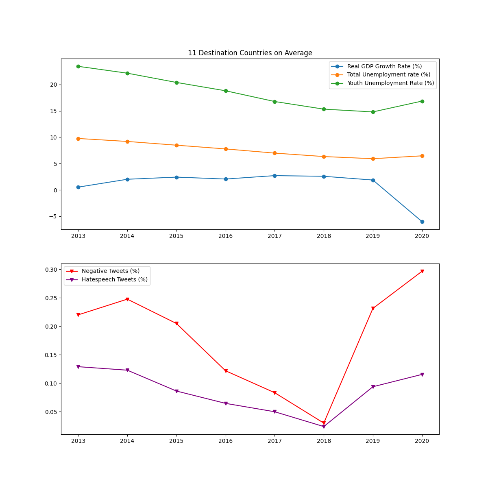
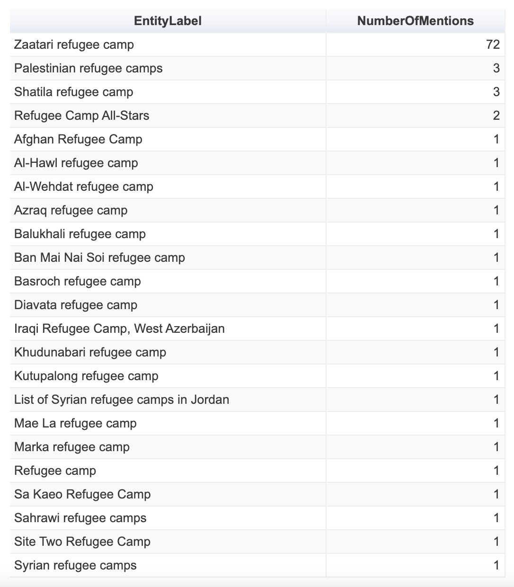
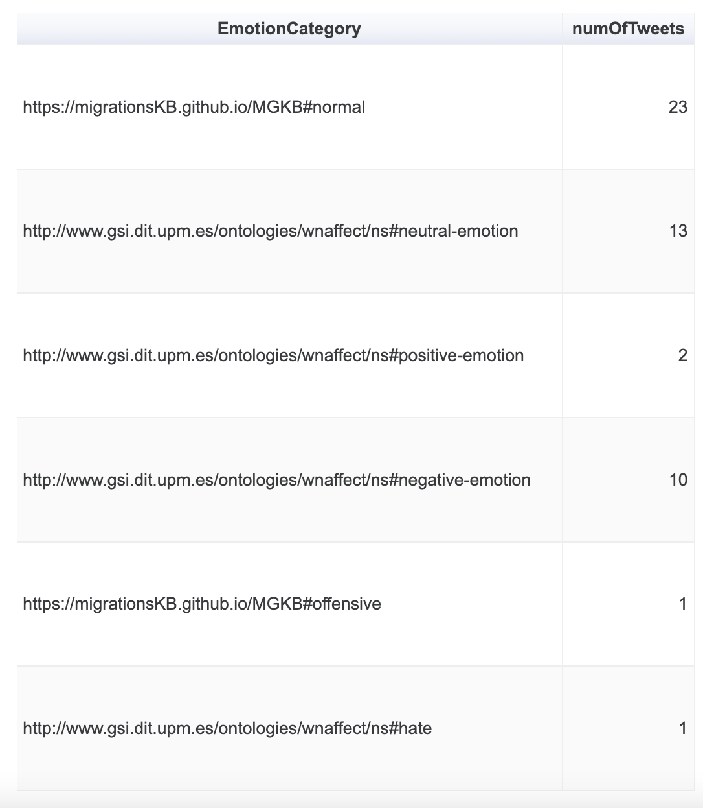

# MigrationsKB


## Introduction

**MigrationsKB(MGKB)** is a public Knowledge Base of anonymized **Migration** related **annotated** tweets.
The MGKB currently contains over **200 thousand** tweets, spanning over 9 years (January 2013 to July 2021),
filtered with 11 European countries of *the United Kingdom, Germany, Spain, Poland, France, Sweden, Austria, Hungary, Switzerland, Netherlands and Italy*.
**Metadata** information about the tweets, such as Geo information (**place name**, **coordinates**, **country code**).
**MGKB** contains **entities**, **sentiments**, **hate speeches**, **topics**, **hashtags**, _encrypted user mentions_ in RDF format.
The schema of **MGKB** is an extension of TweetsKB for migrations related information.
Moreover, to associate and represent the potential economic and social factors driving the migration flows such as [**eurostat**](https://ec.europa.eu/eurostat/web/main/home), 
[**statista**](https://www.statista.com/), etc. FIBO ontology was used. The extracted **economic indicators**,
such as GDP Growth Rate, are connected with each Tweet in RDF using geographical and temporal dimensions.
The user IDs and the tweet texts are encrypted for privacy purposes, while the tweet IDs are preserved.


## RDF/S Model
### Overall Schema


### Schema for Economic Indicators


[Documentation of RDF Model](migrationsKB/documentation.html)

[Codes](https://github.com/migrationsKB/MGKB) 

[Data](https://zenodo.org/record/5205418#.YRomC3Uza0p)

[SPARQL endpoint](https://mgkb.fiz-karlsruhe.de/sparql/)

## Overall Framework


## Purpose
* Provide query-able resource about public attitudes on social media towards migration
* Provide an insight into which factors in terms of economic indicators are the driving factors of that attitude.

## Geo Map of The Tweets
<iframe width="100%" height="520" frameborder="0" src="https://migrationskb.carto.com/builder/69edca56-f1b1-4add-9b2d-ef1ab1e6cf58/embed" allowfullscreen webkitallowfullscreen mozallowfullscreen oallowfullscreen msallowfullscreen></iframe>
[Download `MapOfTweets`](data/MapOfTweets.carto)

## Statistics of the EU countries with the most first time asylum applicants
* [source](https://ec.europa.eu/eurostat/databrowser/view/tps00191/default/table?lang=en) 

  |Country | 2013 | 2014 | 2015 |	2016  | 2017 |	2018 |	2019 |	2020 |	SUM | 
  | ---  | --- | ---  | ---     | ---   | ---    | ---  | ---   | ---  |---|
  | Germany |	126705 |	202645 |	476510 | 745160 |	222565 |	184180 |	165615 |	121955 |	2245335 |
  | Spain	| 4485  |	5615 |	14780 |	15755 |	36610  | 54050  |	117800 |	88530 |	337625 |
  | Poland | 15240 |	8020 |	12190 |	12305 |	5045 |	4110 |	4070 |	2785 |	63765 |
  | France 	| 66265 | 64310 | 76165 |	84270 |	99330 | 137665 | 151070 |	93470 | 772545 |
  |Sweden	| 54270 |	81185  | 162450 | 28795 | 26330 | 21560 | 26255 | 16225  | 417070 | 
  | United Kingdom  | 	30585  | 32785 | 40160 | 39735 | 34780	| 38840 |	46055 |	36041 |	298981 |
  | Austria |	17500 |	28035 |	88160 |	42255  | 24715 |  13710 |	12860 | 14180 | 241415 | 
  | Hungary	| 18895 |	42775 | 177135  |	29430 |	3390  | 670	 | 500  |	115	 | 272910 | 
  | Switzerland	| 21305	 | 23560 | 39445 |	27140 |	18015 |	15160 |	14195 |	10990 |	169810 |
  | Netherlands	| 13065 | 24495  |	44970 | 20945 |	18210|24025 |	25200 |	15255 |	186165 |
  | Italy |	26620 |	64625|	83540 |	122960 |	128850|	59950|	43770 |	26535 |	556850 |	 


## Correlations of the Negative Public Attitudes and The Economic Indicators
More [plots for each destination country](stats.md)

To learn the potential cause of the negative public attitudes towards migrations, the factors such as unemployment
rate including youth unemployment rate and totla unemployment rate, and gross domestic product growth rate (GDPR) were studied.
This data was collected from [Eurostat](https://ec.europa.eu/eurostat), [Statista](https://www.statista.com/),
[UK Parliament](https://www.parliament.uk/), and [Office for National Statistics](https://www.ons.gov.uk/).

The following figure shows the comparison between the factors (such as youth unemployment rate, total unemployment rate,
and real GDPR) and the negative attitudes (i.e., negative sentiment and hate speech) in all the extracted
tweets. On average in all 11 destination countries, the percentages of hate speech and negative sentiment of the public
towards immigration are negatively correlated with the real GDPR and positively correlated with total/youth
unemployment rate, from 2013 to 2018 and from 2019 to 2020. In 2019, the percentages of hateful tweets and negative tweets
are rapidly increased by about 2% and 1% respectively compared to 2018.


. 


## Sparql Queries
* Online SPARQL endpoint Query [example](virtuoso.md).

* Locally 
  * Download `nt` file for **MGKB** on [Zenodo](https://zenodo.org/record/5205418#.YRomC3Uza0p). 
  * Download and run [blazegraph](blazegraph.md)


* Prefixes:
```sparql
prefix mgkb: <https://migrationskb.github.io/MGKB#> 
prefix dc: <http://purl.org/dc/elements/1.1/> 
prefix fibo_fnd_arr_asmt: <https://spec.edmcouncil.org/fibo/ontology/FND/Arrangements/Assessments/> 
prefix fibo_fnd_arr_rep: <https://spec.edmcouncil.org/fibo/ontology/FND/Arrangements/Reporting/> 
prefix fibo_fnd_dt_fd: <https://spec.edmcouncil.org/fibo/ontology/FND/DatesAndTimes/FinancialDates/> 
prefix fibo_fnd_rel_rel: <https://spec.edmcouncil.org/fibo/ontology/FND/Relations/Relations/> 
prefix fibo_fnd_utl_alx: <https://spec.edmcouncil.org/fibo/ontology/FND/Utilities/Analytics/> 
prefix fibo_ind_ei_ei: <https://spec.edmcouncil.org/fibo/ontology/IND/EconomicIndicators/EconomicIndicators/> 
prefix nee: <http://www.ics.forth.gr/isl/oae/core#> 
prefix onyx: <http://www.gsi.dit.upm.es/ontologies/onyx/ns#> 
prefix owl: <http://www.w3.org/2002/07/owl#> 
prefix prov: <https://www.w3.org/TR/prov-o/#> 
prefix rdfs: <http://www.w3.org/2000/01/rdf-schema#> 
prefix rdf: <https://www.w3.org/1999/02/22-rdf-syntax-ns#> 
prefix schema: <http://schema.org/> 
prefix sioc: <http://rdfs.org/sioc/ns#> 
prefix sioc_t: <http://rdfs.org/sioc/types#> 
prefix wna: <http://www.gsi.dit.upm.es/ontologies/wnaffect/ns#> 
prefix xsd: <http://www.w3.org/2001/XMLSchema#>
```

* The following query retrieve a list of top 20 hashtags which contain "refugee" or "immigrant".
```sparql 
SELECT ?hashtagLabel (count(distinct ?tweet) as ?num) WHERE {
  ?tweet schema:mentions ?hashtag.
  ?hashtag a sioc_t:Tag ; rdfs:label ?hashtagLabel.  FILTER( regex(?hashtagLabel, "refugee", "i") || lcase(str(?hashtagLabel))="refugee" ||  regex(?hashtagLabel, "immigrant", "i") || lcase(str(?hashtagLabel))="immigrant").
} GROUP BY ?hashtagLabel ORDER BY DESC(?num) LIMIT 20
```


[comment]: <> ()


* The following query retrieve a list of top 10 the entity labels which contain "refugee" and its frequency of detected entity mentions.
```sparql
SELECT ?entityLabel (count(?entityLabel) as ?numOfEntityMentions)   where{
	?tweet schema:mentions ?entity.
  	?entity a nee:Entity; nee:hasMatchedURI ?uri. 
	?uri a rdfs:Resource; rdfs:label ?entityLabel. FILTER( regex(?entityLabel, "refugee", "i") || lcase(str(?entityLabel))="refugee").
 }GROUP BY ?entityLabel ORDER BY DESC(?numOfEntityMentions) LIMIT 10
```


* The following query retrieves a list of emotion categories (neutral/positive/negative sentiment, 
  and hate speeches/offensive/normal) of tweets where the labels of detected entity mentions containing "refugee camp".

```sparql
SELECT ?EmotionCategory (count(?tweet) as ?numOfTweets)   where{
	?tweet schema:mentions ?entity.
  	?entity a nee:Entity; nee:hasMatchedURI ?uri. 
	?uri a rdfs:Resource; rdfs:label ?x.  FILTER( regex(?x, "refugee camp", "i") || lcase(str(?x))="refugee camp").
  	?tweet onyx:hasEmotionSet ?y.
  	?y a onyx:EmotionSet; onyx:hasEmotion ?z.
  	?z a onyx:Emotion; onyx:hasEmotionCategory ?EmotionCategory.
 } GROUP BY ?EmotionCategory
```


* The following query requests the top-10 hashtags co-occurring with the entity label containing "refugee".

```sparql
SELECT ?hastagLabel (count(distinct ?tweet) as ?num) WHERE {
  ?tweet schema:mentions ?entity .
  ?entity a nee:Entity ; nee:hasMatchedURI ?uri .
  ?uri a rdfs:Resource; rdfs:label ?x.  FILTER( regex(?x, "refugee", "i") || lcase(str(?x))="refugee").

  ?tweet schema:mentions ?hashtag.
  ?hashtag a sioc_t:Tag ; rdfs:label ?hastagLabel 
} GROUP BY ?hastagLabel ORDER BY DESC(?num) LIMIT 10
```


[comment]: <> (![]&#40;images/sparql_query_results/top10_coocur_hashtags_with_entity_refugee.png&#41;)

* The following query retrieves GDPR indicator values and the number of tweet hate speeches in the United Kingdom.
```sparql
SELECT  ?year ?IndicatorValue (count(?tweet) as ?numOfTweets) where {
  ?tweet fibo_fnd_rel_rel:isCharacterizedBy ?gdpr.
  ?gdpr a fibo_ind_ei_ei:GrossDomesticProduct.
  ?gdpr schema:addressCountry "GB". 
  ?gdpr dc:date ?year.
  ?gdpr fibo_ind_ei_ei:hasIndicatorValue ?IndicatorValue.
  ?tweet onyx:hasEmotionSet ?y.
  ?y a onyx:EmotionSet; onyx:hasEmotion ?z.
  ?z a onyx:Emotion; onyx:hasEmotionCategory wna:hate.
 }GROUP BY ?year ?IndicatorValue ORDER BY DESC(?year)
```


* The following query retrieves average GDPR indicator values and the number of tweet hate speeches 
  in 11 destination countries.
```sparql
SELECT  ?year (AVG(?IndicatorValue) AS ?avgIndicatorValue) (count(?tweet) as ?numOfTweets) where {
  ?tweet fibo_fnd_rel_rel:isCharacterizedBy ?gdpr.
  ?gdpr a fibo_ind_ei_ei:GrossDomesticProduct.
  ?gdpr dc:date ?year.
  ?gdpr fibo_ind_ei_ei:hasIndicatorValue ?IndicatorValue.
  ?tweet onyx:hasEmotionSet ?y.
  ?y a onyx:EmotionSet; onyx:hasEmotion ?z.
  ?z a onyx:Emotion; onyx:hasEmotionCategory wna:hate.
 }GROUP BY ?year ORDER BY DESC(?year)
```


* The following query retrieve a list of all the entity labels which contain "refugee camp" and its frequency of detected entity mentions.
```sparql
SELECT ?EntityLabel(count(?EntityLabel) as ?NumberOfMentions)   where{
	?tweet schema:mentions ?entity.
  	?entity a nee:Entity; nee:hasMatchedURI ?uri. 
	?uri a rdfs:Resource; rdfs:label ?EntityLabel. FILTER( regex(?EntityLabel, "refugee camp", "i") || lcase(str(?EntityLabel))="refugee camp").
 }GROUP BY ?EntityLabel ORDER BY DESC(?NumberOfMentions)
```



* The following query retrieve emotions regarding the hashtags containing "refugee".
```sparql
SELECT ?EmotionCategory (count(?tweet) as ?numOfTweets)   where{
	?tweet schema:mentions ?hashtag.
  	?hashtag a sioc_t:Tag; rdfs:label ?x. FILTER( regex(?x, "refugee", "i") || lcase(str(?x))="refugee").
  	?tweet onyx:hasEmotionSet ?y.
  	?y a onyx:EmotionSet; onyx:hasEmotion ?z.
  	?z a onyx:Emotion; onyx:hasEmotionCategory ?EmotionCategory.
 } GROUP BY ?EmotionCategory
```


* The following query retrieves GDPR indicator values and the number of negative sentiment tweets in the United Kingdom.
```sparql
SELECT  ?year ?IndicatorValue (count(?tweet) as ?numOfTweets) where {
  ?tweet fibo_fnd_rel_rel:isCharacterizedBy ?gdpr.
  ?gdpr a fibo_ind_ei_ei:GrossDomesticProduct.
  ?gdpr schema:addressCountry "GB". 
  ?gdpr dc:date ?year.
  ?gdpr fibo_ind_ei_ei:hasIndicatorValue ?IndicatorValue.
  ?tweet onyx:hasEmotionSet ?y.
  ?y a onyx:EmotionSet; onyx:hasEmotion ?z.
  ?z a onyx:Emotion; onyx:hasEmotionCategory wna:negative-emotion.
 }GROUP BY ?year ?IndicatorValue ORDER BY DESC(?year)
```


* The following query requests the top-10 hashtags co-occurring with the entity label containing "refugee camp".

```sparql
SELECT ?hastagLabel (count(distinct ?tweet) as ?num) WHERE {
  ?tweet schema:mentions ?entity .
  ?entity a nee:Entity ; nee:hasMatchedURI ?uri .
  ?uri a rdfs:Resource; rdfs:label ?x.  FILTER( regex(?x, "refugee camp", "i") || lcase(str(?x))="refugee camp").

  ?tweet schema:mentions ?hashtag.
  ?hashtag a sioc_t:Tag ; rdfs:label ?hastagLabel 
} GROUP BY ?hastagLabel ORDER BY DESC(?num) LIMIT 10
```


* The following query retrieves a list of emotion categories (neutral/positive/negative sentiment, 
  and hate speeches/offensive/normal) of tweets where the labels of detected entity mentions containing "refugeecamp".

```sparql
SELECT ?EmotionCategory (count(?tweet) as ?numOfTweets)   where{
	?tweet schema:mentions ?hashtag.
  	?hashtag a sioc_t:Tag; rdfs:label ?x. FILTER( regex(?x, "refugeecamp", "i") || lcase(str(?x))="refugeecamp").
  	?tweet onyx:hasEmotionSet ?y.
  	?y a onyx:EmotionSet; onyx:hasEmotion ?z.
  	?z a onyx:Emotion; onyx:hasEmotionCategory ?EmotionCategory.
 } GROUP BY ?EmotionCategory

```



* The following query retrieves the number of tweets about a particular refugee camp "zaatari refugee camp".
```sparql
SELECT (count(?tweet) as ?num)   where{
	?tweet schema:mentions ?entity.
  	?entity a nee:Entity; nee:hasMatchedURI ?uri. 
	?uri a rdfs:Resource; rdfs:label ?x. FILTER(  lcase(str(?x))="zaatari refugee camp").
 }
```


## About

<a rel="license" href="http://creativecommons.org/licenses/by/4.0/"></a><br />This work is licensed under a <a rel="license" href="http://creativecommons.org/licenses/by/4.0/">Creative Commons Attribution 4.0 International License</a>.
