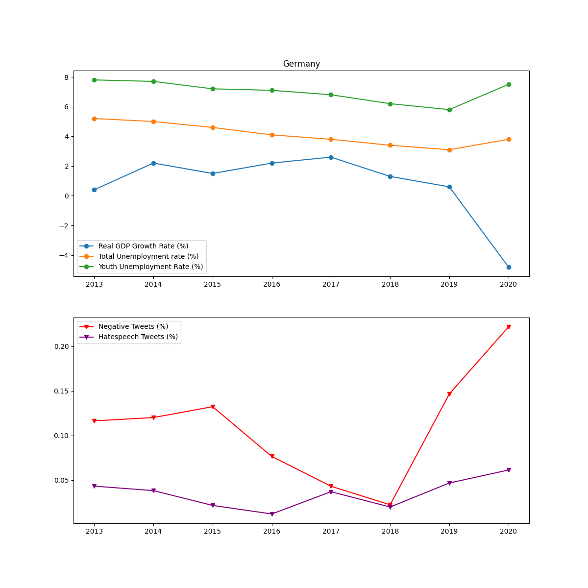
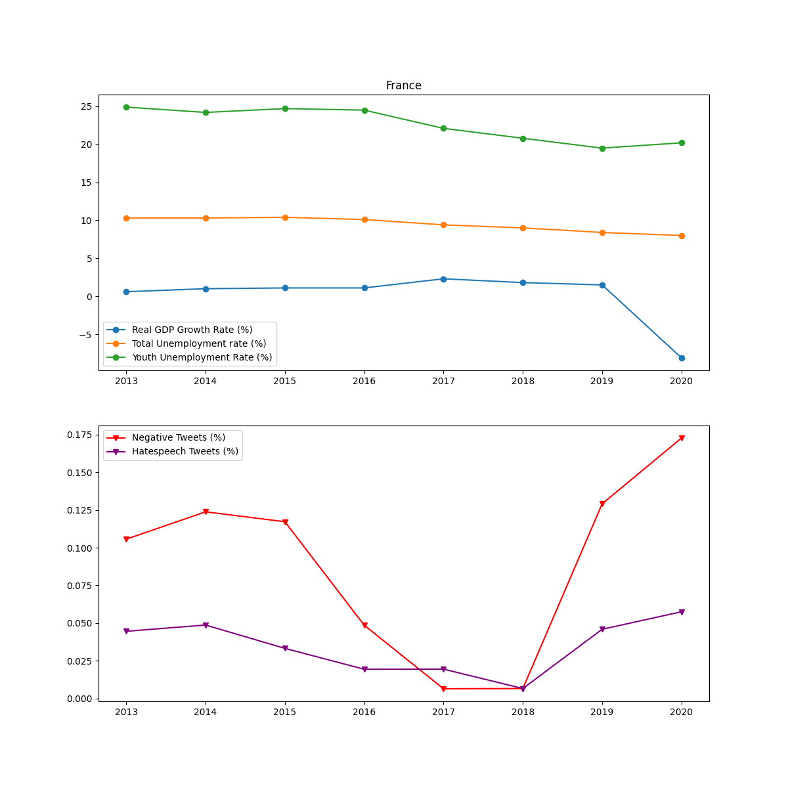
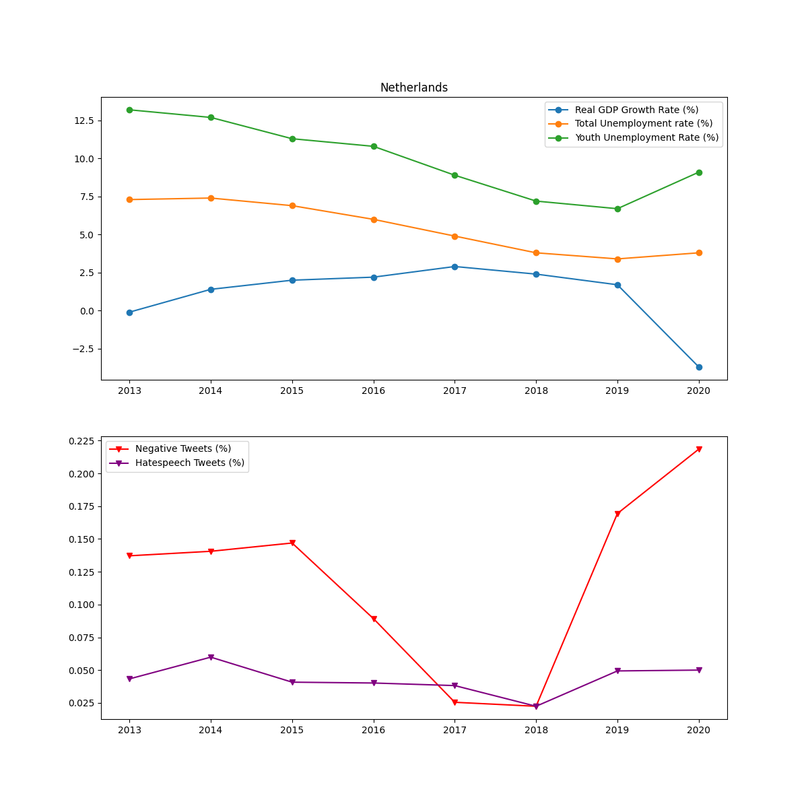
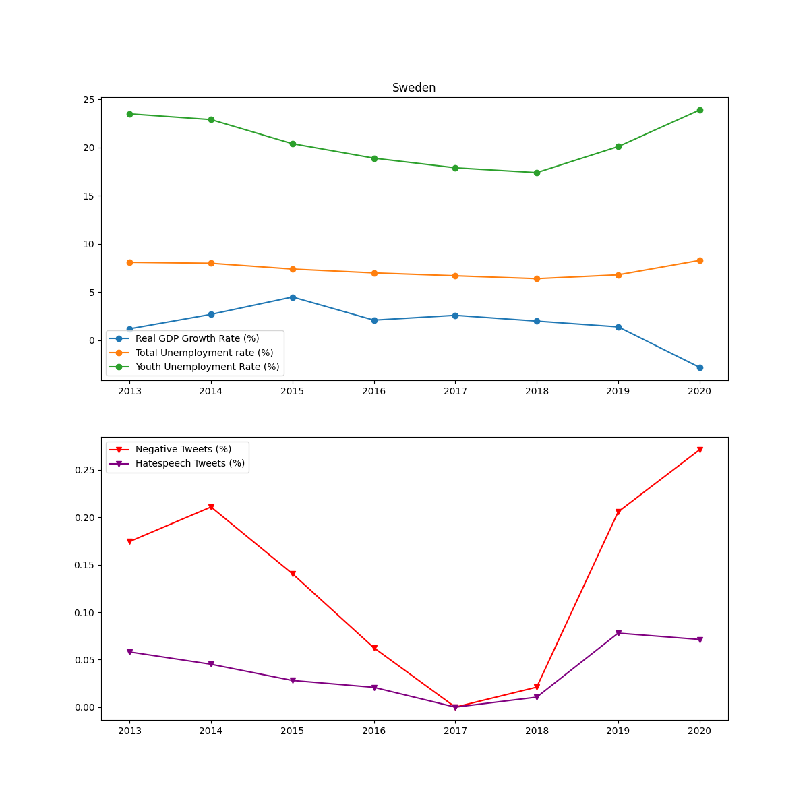

[Home](index.md)

* Germany 

 Figure 

* Austria

 Figure 

* Switzerland

 Figure 

* Spain 

 Figure 

* France

 Figure 

* United Kingdom

 Figure 

* Italy 

 Figure 

* Netherlands

 Figure 

* Poland

 Figure 

* Sweden

 Figure 

* Hungary

 Figure 

