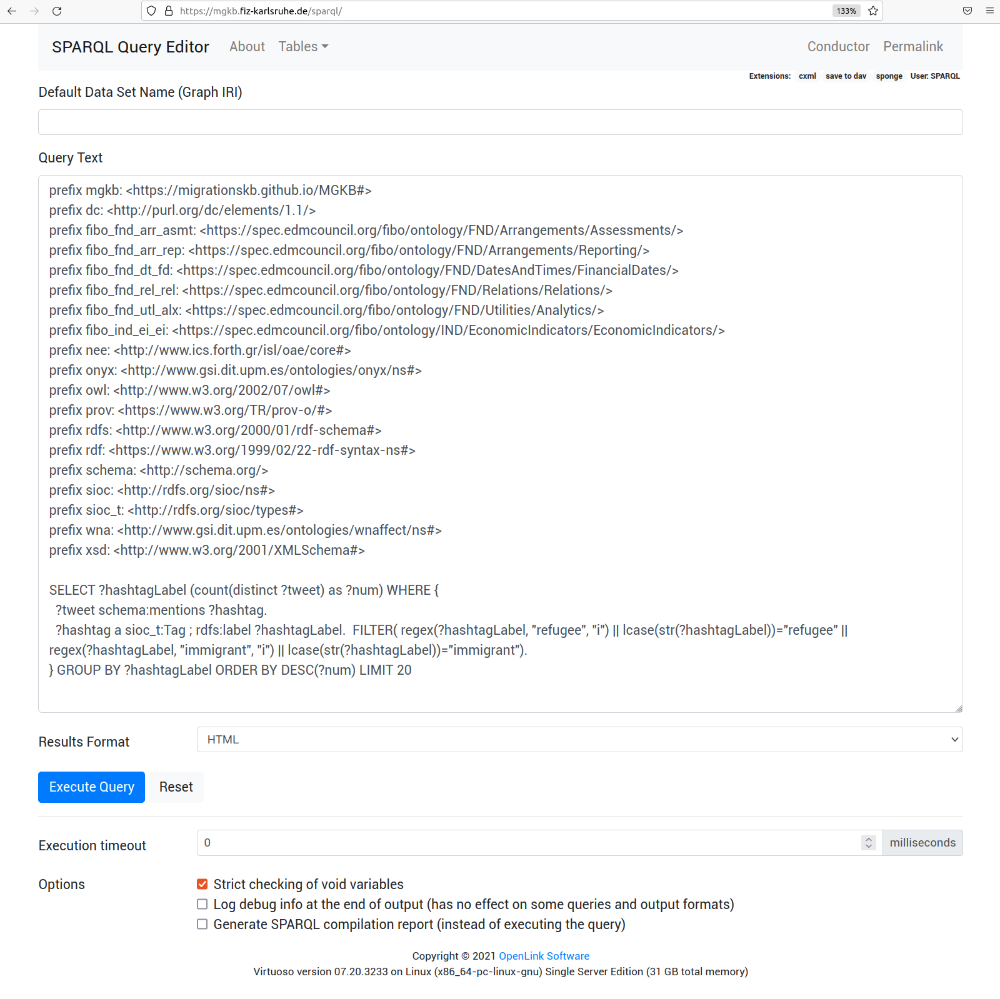

[Home](index.md)

## SPARQL Query Example in Virtuoso

Go to [https://mgkb.fiz-karlsruhe.de/sparql/](https://mgkb.fiz-karlsruhe.de/sparql/)

Input `Query Text` and click `Excute Query`, different results formats can be chosen.
